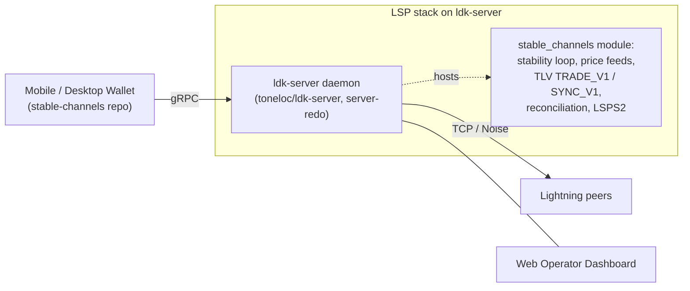

# Stable Channels: BTC/USD Lightning Wallet — Server and LSP Development

## Overview

Stable Channels is a self-custodial Bitcoin wallet that lets a user peg a portion of their BTC to a USD value using continuous, bilateral settlement over Lightning. The architecture is Phoenix-style: a mobile/desktop wallet connects to a Lightning Service Provider (LSP) that manages channels and liquidity on the server side. Both sides stay self-custodial — the user can exit any time via cooperative or force-close.

This proposal covers hardening the server-side stack and packaging it so third parties can run a Stable Channels LSP with one click.

## Architecture

The project spans two repositories:

| Repo | Role |
|------|------|
| [`toneloc/ldk-server`](https://github.com/toneloc/ldk-server/) (fork of [`lightningdevkit/ldk-server`](https://github.com/lightningdevkit/ldk-server/)) | Production LSP daemon. Stable-channel logic lives here. Active branch: `server-redo`. |
| [`toneloc/stable-channels`](https://github.com/toneloc/stable-channels/) (this repo) | User-facing wallet (mobile + desktop) that talks to the daemon via its gRPC client library. |

**Transitional state (today).** This repo contains [src/bin/lsp_backend.rs](src/bin/lsp_backend.rs) — a self-contained LSP binary built directly on upstream `ldk-node`. It is a dev stopgap and will be retired once the fork's stable-channel integration lands on `server-redo`. The canonical stable-channel domain logic in [src/stable.rs](src/stable.rs) and [src/price_feeds.rs](src/price_feeds.rs) is the material being ported into the fork.

## Expected Outcomes

1. **Stabilize the LSP** so it reliably handles stable-channel operations — sends, receives, buys/sells (trades), channel opens, liquidity management — on the `toneloc/ldk-server` fork (`server-redo` branch).
2. **Web-based operator dashboard** for monitoring channels and system health, served from the daemon.
3. **Umbrel app packaging** so home-node operators can run a Stable Channels LSP with one click.
4. **End-to-end demo video** walkthrough of the full system.

## Workstreams

### WS1 — Port stable-channel logic into the fork (foundation)

Target: [toneloc/ldk-server](https://github.com/toneloc/ldk-server/), `server-redo` branch.

Source material from this repo to port:

- [src/stable.rs](src/stable.rs) — `check_stability`, `reconcile_outgoing`, `reconcile_forwarded`, `reconcile_incoming`, `apply_trade`, `recompute_native`.
- [src/price_feeds.rs](src/price_feeds.rs) — median-of-5 REST price feeds.
- TLV `TRADE_V1` / `SYNC_V1` handlers (custom record type `13377331`) currently in [src/bin/lsp_backend.rs](src/bin/lsp_backend.rs).
- LSPS2 service config — [src/bin/lsp_backend.rs:1211-1223](src/bin/lsp_backend.rs#L1211-L1223).
- Splice reconciliation — [src/bin/lsp_backend.rs:1450-1510](src/bin/lsp_backend.rs#L1450-L1510).
- Forwarded-payment reconciliation — [src/bin/lsp_backend.rs:1573-1957](src/bin/lsp_backend.rs#L1573-L1957).
- Audit event schema — [src/audit.rs](src/audit.rs). SQLite schema — [src/db.rs](src/db.rs).

New surface in the fork:

- A `stable_channels/` module inside the daemon.
- A background task spawned on startup driving the stability loop (60s tick).
- Event hooks into LDK Node's `PaymentForwarded`, `ChannelReady`, `ChannelClosed` for reconciliation.

Protocol additions to `ldk-server-protos`:

- `GetStabilityStatus(channel_id)` — drift %, backing_sats, native_sats, last payment.
- `ListStableChannels` — per-channel summary with target USD, peer online state.
- `EditStableChannel(channel_id, target_usd, note)` — operator mutation.
- `StreamStabilityEvents` — server-stream for dashboard live updates.

### WS2 — Harden the daemon for production

Applied to the fork, not to `lsp_backend.rs`:

- `/health` endpoint (LDK node status, peer count, DB connectivity, price age, uptime) and `/metrics` in Prometheus text format.
- Structured logging via `tracing` with a JSON subscriber in prod.
- API authentication (API key or mTLS — ldk-server already supports TLS certs out of the box).
- Rate limiting on public-facing endpoints.
- Price-feed resilience: parallel fetch of all 5 sources, quorum of ≥3 required, staleness circuit breaker that pauses stability payments if cached price is >60s old.
- Keysend retry with exponential backoff (max 3 attempts); on repeated failure, mark the channel `risk_level` and emit an audit event for operator attention.
- Force-close reconciliation in the `ChannelClosed` handler.
- Config via env vars: network, data_dir, API key, stability interval/threshold, price cache TTL.

### WS3 — Web operator dashboard

Target: the fork, either extending `ldk-server-gui` or adding a `static/` directory served from the daemon's HTTP layer.

Pages:

- **Summary** — total channels, total capacity (BTC + USD), total USD exposure, peers online/total, system uptime.
- **Channels table** — sortable by capacity, drift %, status. Per-row: channel id, peer pubkey, expected_usd, current_usd, drift %, backing_sats, native_sats, online status. Row expand → payment history, edit target_usd, close.
- **Price + drift chart** — live-updating line chart of BTC price and per-channel drift over time (Chart.js via CDN, no build step).
- **Alerts panel** — color-coded list of active issues: high drift, offline peers, stale price, failed payments in last hour.
- **Audit log viewer** — scrollable, filterable, auto-refreshing.

Real-time updates via SSE or the `StreamStabilityEvents` gRPC stream. Dashboard auth uses the same API key / session token as the daemon.

### WS4 — Umbrel packaging

Start point: upstream [`ldk-server`](https://github.com/lightningdevkit/ldk-server/) already ships an `umbrel/` directory. The Stable Channels variant inherits from it and adds:

- `umbrel-app.yml` — app metadata (name, icon, ports `9735` + dashboard port, deps: `bitcoind`, `electrs`).
- `docker-compose.yml` overrides — wire `APP_BITCOIN_NODE_IP` / `APP_ELECTRS_NODE_IP` env vars to connect to Umbrel's bundled services rather than running our own.
- `exports.sh` — expose LSP pubkey, Lightning port, and dashboard URL to other Umbrel apps.
- Data persistence for LDK node data + the stable-channel SQLite DB on Umbrel's app-data volume.

Test on `umbrel-dev` (the docker-based dev environment).

### WS5 — Demo + docs

End-to-end video:

1. One-click install of the Stable Channels LSP app on Umbrel.
2. Open the web dashboard, tour summary / channels / chart.
3. Mobile app connects to the LSP, opens a stable channel.
4. Price movement (testnet mock or live) triggers stability payments. Drift % updates on the dashboard, payments appear in audit log.
5. Operator actions: edit channel target USD, view P&L, check alerts, close a channel.

Documentation:

- [README.md](README.md) updated with new architecture diagram, quickstart (Docker / Umbrel / manual), API reference, config reference.
- `OPERATOR_GUIDE.md` walking a new operator through running a Stable Channels LSP.
- Repo READMEs (both this one and the fork) cross-link.

## Role of this repo (stable-channels)

- Home of the user-facing wallet app — desktop ([src/user.rs](src/user.rs)) and mobile ([android/](android/), [ios/](ios/)).
- After WS1 lands, the wallet depends on the fork's `ldk-server-client` crate (gRPC) instead of using `ldk-node` directly.
- [src/bin/lsp_backend.rs](src/bin/lsp_backend.rs) and [src/bin/lsp_frontend.rs](src/bin/lsp_frontend.rs) are slated for removal once the fork's daemon is the source of truth.
- PROPOSAL.md lives here because this repo is the public face of the project.

## Skills Required

- Understanding of Bitcoin and Bitcoin wallets.
- Rust programming experience.
- Hands-on experience with git (working across a fork relationship).
- Hands-on experience with Docker (Umbrel app development).

## Resources

- Stable Channels repo: <https://github.com/toneloc/stable-channels/>
- LDK Server fork: <https://github.com/toneloc/ldk-server/> (active branch: `server-redo`)
- LDK Server upstream: <https://github.com/lightningdevkit/ldk-server/>
- Umbrel app development docs: <https://github.com/getumbrel/umbrel-apps>
- Delving Bitcoin discussion: <https://delvingbitcoin.org/t/stable-channels-peer-to-peer-dollar-balances-on-lightning>
- Stability mechanics (this repo): [stability_logic.md](stability_logic.md)
- Historical execution roadmap (this repo): [PLAN.md](PLAN.md) — predates the migration decision; kept for reference.

## Non-goals

- Not a rewrite of `ldk-node` or `rust-lightning`.
- Not a new price-oracle protocol (uses existing REST exchange APIs).
- Not shipping routing support — stable channels are non-routing today.
- Not hardening [src/bin/lsp_backend.rs](src/bin/lsp_backend.rs); that binary is being retired.

## Open questions

- Will stable-channel code on the fork's `server-redo` eventually merge into the fork's `main`, or stay on a long-lived branch?
- Will upstream `lightningdevkit/ldk-server` accept a `stable_channels/` module as a gated feature, or does the fork stay permanently separate?
- Does upstream ldk-server's existing `umbrel/` directory already handle `bitcoind` / `electrs` wiring in a way Stable Channels can inherit, or do we need new compose overrides from scratch?
- Retirement plan for [src/bin/lsp_backend.rs](src/bin/lsp_backend.rs): deleted in one PR once the fork ships, or kept as a regtest harness?
